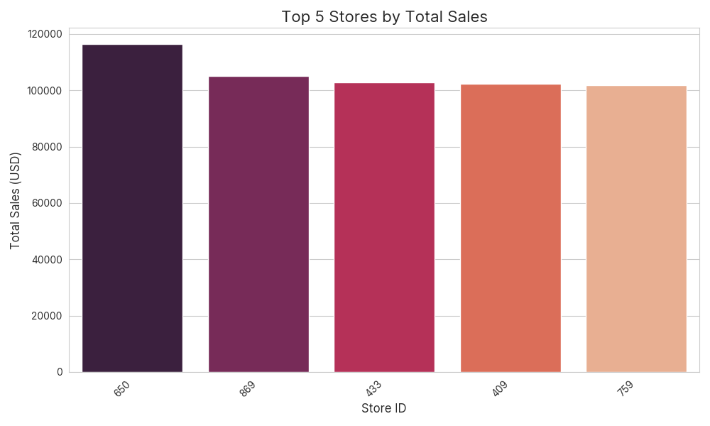
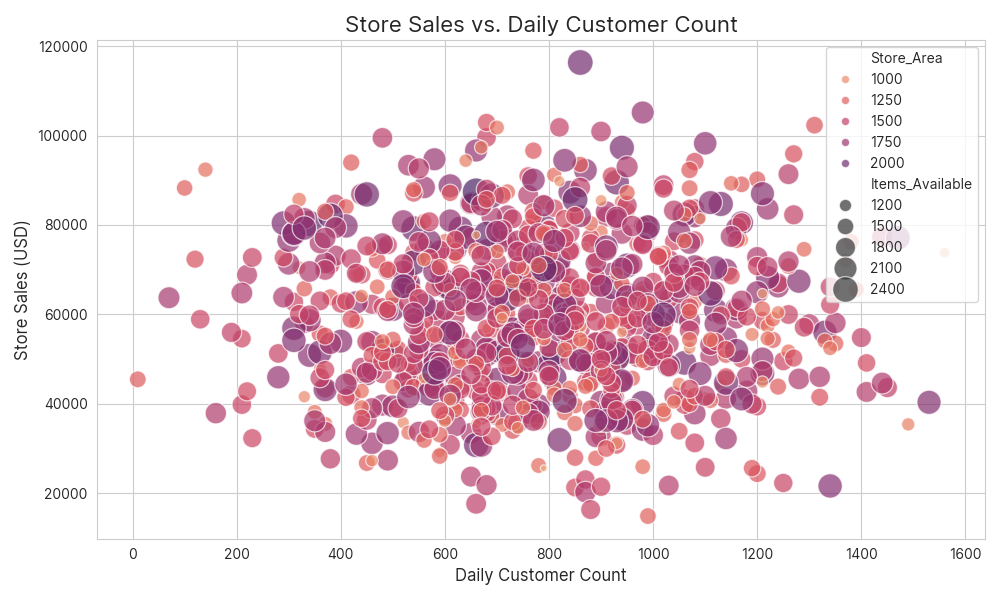
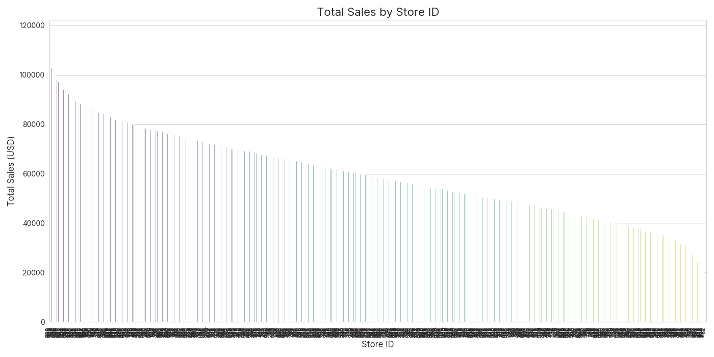
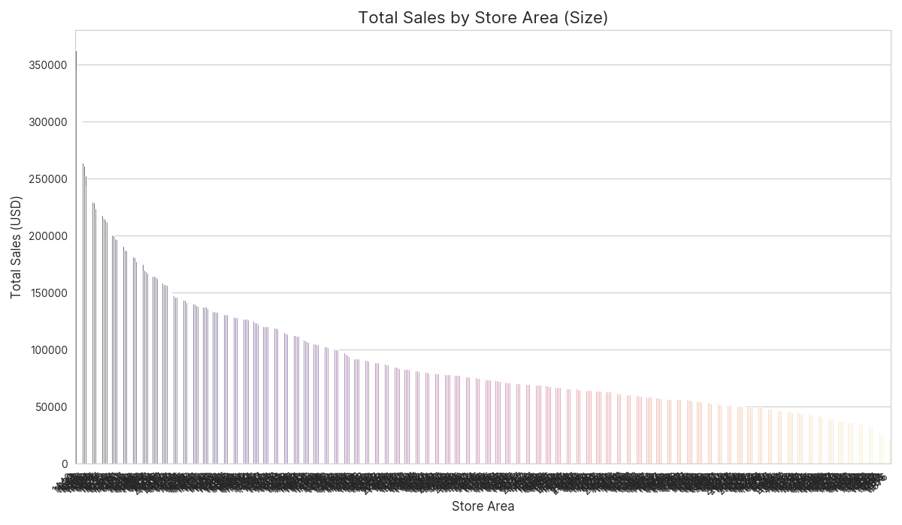
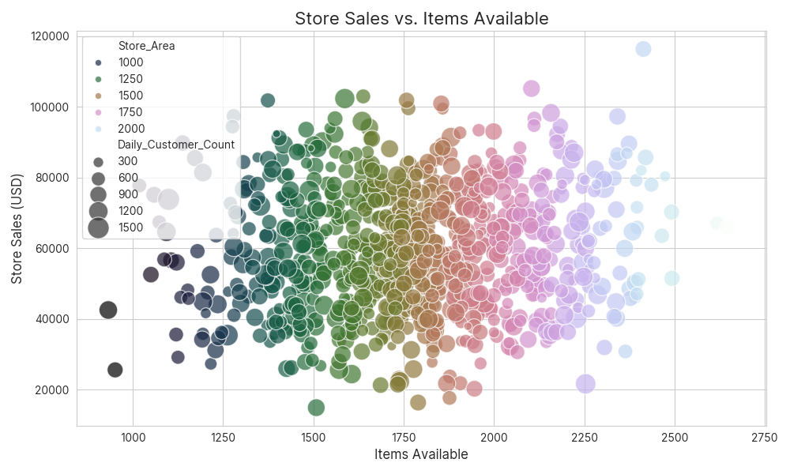

# 📊 Sales Analysis Dashboard

A complete **Data Analysis & Visualization** project built in Python to analyze supermarket sales data.  
This dashboard helps uncover hidden patterns and performance insights that support business decisions.

---

## 🔍 Project Overview

This project focuses on analyzing retail data to answer key business questions using Python and visualization tools.  
It includes data loading, cleaning, exploration, and visual storytelling.

---

## 🧠 Business Questions Answered

- 📈 Which store generates the highest revenue?
- 📐 Does store area influence sales?
- 🥇 What are the top 5 stores by total revenue?
- 📦 How does item availability relate to revenue?
- 👥 Does customer count affect store sales?

---

## 📊 Sample Visualizations

| Visual | Description |
|--------|-------------|
|  | Top revenue-generating stores |
|  | Customer count vs revenue correlation |
|  | Sales comparison across stores |
|  | Area-based performance |
|  | Inventory effect on sales |

---

## 🧰 Tech Stack

| Tool        | Purpose                          |
|-------------|----------------------------------|
| Python      | Core programming language        |
| Pandas      | Data manipulation & cleaning     |
| NumPy       | Numerical operations             |
| Matplotlib  | Static visualizations            |
| Seaborn     | Statistical data plots           |
| Jupyter / IDE | Development environment         |

---

## 📁 Project Folder Structure

```
Sales Analysis/
├── data/
│   └── Supermarket Sales Data.csv
├── reports/
│   ├── total_sales_by_store_id.png
│   ├── sales_by_store_area.png
│   ├── top_5_stores_by_sales.png
│   ├── sales_vs_items_available.png
│   └── sales_vs_customer_count.png
├── main_analysis.py
├── requirements.txt
└── README.md
```

---

## 🛠️ How to Run the Project

### 1. Clone the Repository

```bash
git clone https://github.com/SkSankeeth/sales-analysis-dashboard.git
cd sales-analysis-dashboard
```

### 2. Install Dependencies

```bash
pip install -r requirements.txt
```

### 3. Run the Analysis Script

```bash
python main_analysis.py
```

All output visualizations will be saved inside the `/reports/` directory.

---

## ✅ Key Features

- Automated data loading with fallback mock dataset
- Clear handling of missing values & outliers
- Multiple visualizations saved as PNGs
- Business logic integrated into analysis
- Fully modular & readable Python code
- Professional-quality documentation

---

## 🎯 Learning Outcomes

- Structured and modular Python programming
- Hands-on data cleaning and exploration
- Visual analytics and storytelling using real business context
- Git and GitHub collaboration workflow
- Deploying your work as portfolio-ready projects

---

## 🤝 Let’s Connect

🔗 [LinkedIn – Sankeeth Sithamparanathan](www.linkedin.com/in/sankeeth-sithamparanathan-83765a30a)  
📬 DM me for collaboration, feedback, or internship opportunities!  

---

## 📌 Tags

`#Python` `#DataScience` `#EDA` `#PortfolioProject` `#RetailAnalysis` `#Visualization` `#Analytics`
